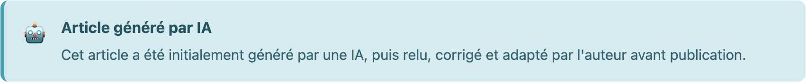
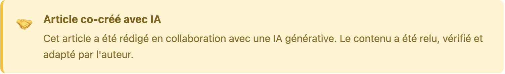
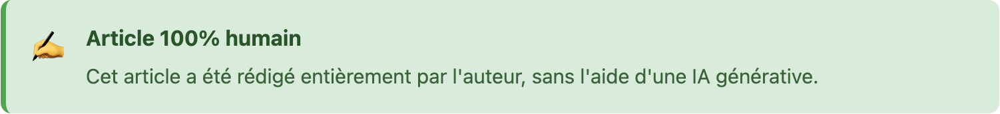

## TL;DR - L'essentiel en 30 secondes ⚡

J'ai donc 30 secondes pour vous convaincre d'en prendre un peu plus pour lire la suite...

Y'a des dragons qui debug des infras, des licornes qui pwn des états et moi qui galère à vous accrocher, donc j'arrête le tir et à vous de voir pour la suite !

## PoIntro

On va commencer par les présentations d'usage, Benoît, bientôt la quarantaine (mais j'le vis bien), ingénieur DevOps depuis 2019, et passionné de tech, de geekerie en tout genre, de science fiction, de manga... depuis toujours.

Bref, j'en garde un peu pour peut être réussir à vous surprendre au fil des posts.

Le but de ce blog sera essentiellement de décharger mon cerveau, centraliser des idées, des reflections, des snippets et des tutos en lien avec mon "vis ma vie" de DevOps, ou pas.

On va tenter d'être le plus pertinent possible hein, j'espère bien réussir à garder cet espace aussi clean que possible, une sorte de bdd fun à utiliser.

***

## IA : une aide, pas un _ghostwriter_

En 2025, il serait idiot de ne pas me faire aider par une IA, j'ai donc mis en place une balise présente en début d'article qui me permet de mettre en avant les moyens utilisés pour la rédaction:

1. Rédaction par une IA, puis relecture et correction par moi-même avant publication
2. En partie rédigé avec l'aide d'une IA
3. 100% rédigé par un humain, moi-même !

Voilà à quoi ça ressemble pour le moment:

Comme ça, pas de doute !\
Je ferais bien évidemment un gros travail pour vérifier les infos crachés par l'IA attentivement, mon but étant de délivrer une information juste et de qualité, soyez-en sur.

Si vous aussi vous bossez dans la tech, vous savez à quel point elle peut être pertinente lorsque l'ont sait s'en servir.\
D'ailleurs, ce blog a été créé from-scratch avec Claude Code sur Sonnet 4.5, en seulement quelques heures. J'en ferait un article dédié, il faut absolument que je partage cette experience, parfois magique, parfois incompréhensible, il y'a deux trois trucs à partager qui pourrait vous aider si vous utilisez cet outil ;)

***

## EXIT 0

Le crash test est fini, ça va c'était pas si compliqué, je pourrais y prendre goût...

Rendez-vous au prochain épisode, merci de m'avoir lu !
